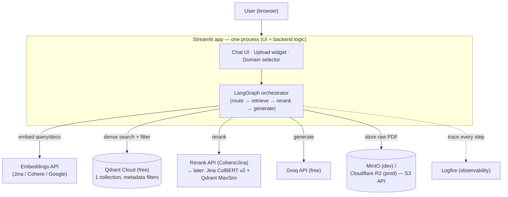
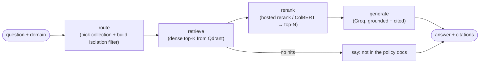
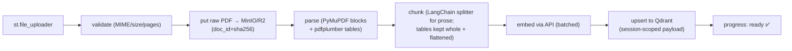
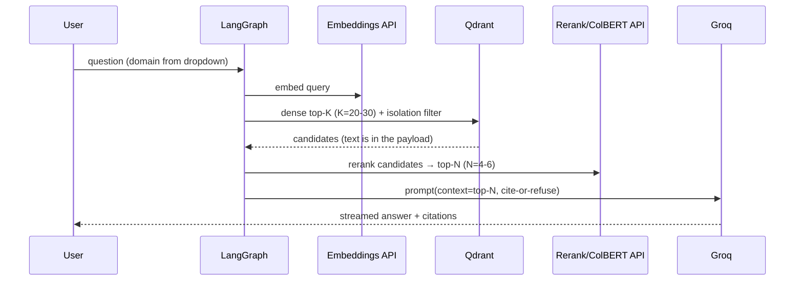

# Multi-Category Policy RAG — **Demo** Architecture

> **Status:** Demo v2.0 (conference) — revised for *no local GPU / low-spec dev machine*.
> **Guiding constraint:** every heavy ML step (embedding, reranking, generation) is a **hosted API**. Your machine and the deploy host only do HTTP calls + light orchestration — no model weights, no GPU, no big RAM.
> **Full production design:** [`Architecture.prod.md`](./Architecture.prod.md).
> **Stack:** Streamlit (UI + backend, one process) · LangGraph (orchestration) · Qdrant Cloud · hosted embeddings + hosted ColBERT/rerank · Groq (LLM) · Logfire (observability) · `uv`.

---

## 0. The key decision: everything heavy is hosted

Because you have no GPU and a low-spec box, we **do not run any model locally** — not even the small embedding model from v1. Instead:

| Step | v1 (local CPU) | v2 (hosted API) — **chosen** |
|---|---|---|
| Dense embeddings | `bge-small` on CPU | **Jina / Cohere / Google embeddings API** |
| Reranking | ColBERT on CPU | **Hosted rerank API** → then **Jina ColBERT v2 API + Qdrant MaxSim** |
| Generation | (already hosted) | **Groq API** (unchanged) |

Consequence: the Streamlit process is now **I/O-bound, not compute-bound**. It fits comfortably on any free tier and on your laptop, because it's just making network requests and stitching results together.

---

## 1. Topology



The only compute that ever touches your hardware is PDF parsing (pure-Python `PyMuPDF`/`pdfplumber`, which is light) and JSON wrangling. Everything with a neural network in it is behind an API boundary.

---

## 2. Do we need LangChain / LangGraph?

**Short answer: LangChain — optional, use it lightly. LangGraph — recommended, and here's specifically why.**

A bare linear RAG (embed → search → rerank → generate) does **not** require either; plain Python functions work. But your app has two real branches that make a graph genuinely useful:

1. **Domain routing** — Vehicle vs Term vs General (from the dropdown, or later auto-detected).
2. **Curated vs. uploaded** — should this question search the curated corpus, the user's just-uploaded PDF, or both?

LangGraph models exactly this as a small state machine, and — importantly for you — **each node becomes a Logfire span automatically**, so your observability and your control flow come from the same structure.

### How LangGraph is used



The shared **state** flowing through the graph:

```python
class RAGState(TypedDict):
    question: str
    domain: str            # vehicle | term | general
    session_id: str
    use_upload: bool
    filter: dict           # Qdrant filter, built in `route`, never from user text
    candidates: list       # after retrieve
    reranked: list         # after rerank
    answer: str
    citations: list
```

### How LangChain is (lightly) used
- **Integration adapters** — `langchain-cohere`, `langchain-groq`, `langchain-qdrant` give you uniform `Embeddings` / `ChatModel` / `VectorStore` objects, so swapping a provider is a one-line change.
- **Text splitting** — `RecursiveCharacterTextSplitter` / `MarkdownHeaderTextSplitter` for prose chunking (we still hand-handle tables — see §5).
- That's it. Don't pull in LangChain's chains/agents; the LangGraph nodes call the hosted APIs directly.

> **Verdict:** LangGraph for the flow (5 small nodes) + LangChain only for adapters and splitters. If you'd rather keep it dependency-light, the same 5 nodes are ~120 lines of plain Python — the architecture doesn't depend on the framework.

---

## 3. Where the backend lives and how it's deployed

**There is no separate backend server in the demo.** The "backend" is a plain Python package (`rag/`) that the Streamlit process imports and runs **in the same process**. Streamlit *is* the server.

```
┌──────────────────────────────────────────────┐
│  One deployed app (one container / one URL)    │
│                                                │
│   Streamlit  ──imports──▶  rag/  (the backend) │
│     UI + session state       ingest/retrieve/  │
│                              rerank/generate    │
└───────────────┬───────────────┬────────────────┘
                │ HTTPS          │ HTTPS
        Qdrant Cloud     Embeddings/Rerank/Groq/R2
```

Why this is the right call here: since all heavy work is offloaded to hosted APIs, there's nothing CPU-heavy left to isolate into its own service. A separate FastAPI backend would add a network hop and a second deployment for zero benefit at demo scale.

**Deploy targets (pick one, all free):**

| Host | Notes |
|---|---|
| **Streamlit Community Cloud** | Easiest: connect GitHub, set secrets, done. Best first choice. |
| **Hugging Face Spaces** (Streamlit SDK, free CPU) | Good if you want a `Dockerfile` and more control. |
| **Fly.io / Render free** | If you later split out a FastAPI backend, host it here. |

> **When *would* you split out a FastAPI backend?** Only if you later need: a non-Streamlit client (mobile, another site), long-running jobs beyond a request, or independent scaling. For the conference demo, keep the monolith. The `rag/` package is written framework-agnostic, so wrapping it in FastAPI later is a small, additive step — it's noted in `Architecture.prod.md`.

---

## 4. Object storage — MinIO (dev) → Cloudflare R2 (prod)

Since you know MinIO, use it as your **local dev** S3, and **Cloudflare R2** (S3-compatible, free 10 GB) in the cloud. The same `boto3` / `minio` client code works against both — only the endpoint + keys change.

```python
# one client, two backends via config
import boto3
s3 = boto3.client("s3",
    endpoint_url=CFG.s3_endpoint,   # http://localhost:9000 (MinIO) | R2 endpoint
    aws_access_key_id=CFG.s3_key,
    aws_secret_access_key=CFG.s3_secret)
s3.put_object(Bucket="policies", Key=f"raw/{doc_id}.pdf", Body=pdf_bytes)
```

**Is object storage even needed for the demo?** Strictly, no — you can parse the uploaded PDF straight from the in-memory buffer and only keep the chunks in Qdrant. But keeping the raw PDF lets you (a) re-process without re-uploading and (b) show the original page for a citation. Since you're comfortable with MinIO, keeping it is low-cost and makes the demo feel real. Bucket layout:

```
policies/
├── curated/{domain}/{doc_id}.pdf   # persistent
└── uploads/{session_id}/{doc_id}.pdf  # deleted on TTL expiry (§6)
```

---

## 5. Ingestion (no broker, no worker fleet)

Upload handling runs in a `threading.Thread` off the Streamlit callback with a progress bar. Parsing is the only local compute and it's light.



- **Layout handling (light):** PyMuPDF gives text blocks with bounding boxes; multi-column pages are fixed by clustering word `x0` and reading each column top-to-bottom. `pdfplumber` extracts tables → Markdown + a flattened "row → value" rendering so the embedder matches cell content.
- **Batched embedding:** send chunks to the embeddings API in batches (respect the provider's batch limit) — this is one-time for the curated corpus and a few seconds per uploaded PDF.
- **Idempotent:** `doc_id = sha256(bytes)`; identical re-uploads skip processing.

---

## 6. Storage, isolation & TTL (same as v1, unchanged)

One Qdrant collection `policies`; isolation via a **server-injected metadata filter** (built in the LangGraph `route` node from the dropdown — never from user text).

```jsonc
// point payload
{
  "domain": "vehicle|term|general",   // filter key (indexed)
  "source": "curated|user_upload",    // indexed
  "session_id": "sess_...",           // uploads only (indexed)
  "expires_at": 1731000000,           // uploads only (indexed)
  "doc_id": "sha256...", "page": 12,
  "section_path": "4 > Exclusions",
  "text": "full chunk text",          // stored here → no separate doc DB
  "text_render": "flattened table"
}
```

- **Curated query filter:** `must:[domain==selected, source==curated]` → a Vehicle question can never reach Term vectors.
- **Uploads:** tagged `session_id` + `expires_at = now+2h`. Query filter unions curated ∪ `(session_id==current AND expires_at>now())`.
- **TTL without cron:** every query filters `expires_at>now()` (expired data instantly invisible); a background timer thread opportunistically runs `client.delete(filter: expires_at<now())` and deletes the matching `uploads/{session_id}/` objects from MinIO/R2.

---

## 7. Retrieval + reranking — including a gentle ColBERT plan

### 7.1 The flow



### 7.2 What ColBERT actually is (the 2-minute version)

A normal embedding model squashes a whole chunk into **one** vector; search compares one query vector to one doc vector. That loses detail. **ColBERT ("late interaction")** instead keeps **one vector per token**. To score a (query, doc) pair it computes **MaxSim**: for each *query* token, find its best-matching *doc* token, then sum those best matches. This matches at word granularity — perfect for insurance nuance like *"does this exclusion apply to this peril?"* where the exact clause wording matters. The cost is: more vectors to store, and the scoring step. **"Late"** = the interaction happens after encoding, at search time, not baked into a single vector.

### 7.3 How we get ColBERT with **no GPU** — two steps you can take in order

**Step A — ship first with a hosted rerank API (simplest, do this on day 1).**
A hosted reranker (Cohere Rerank or Jina Reranker) is a cross-encoder that plays the *same role* as ColBERT: you send the query + the ~20 candidate texts, it returns relevance scores, you keep the top 4–6. One API call, no vectors to store, no local compute. This gets your two-stage retrieval working end-to-end immediately.

```python
# Step A: hosted rerank — one call, no local model
scores = cohere.rerank(query=q, documents=[c.text for c in candidates],
                       top_n=6, model="rerank-3.5")
```

**Step B — graduate to *real* ColBERT via API + Qdrant (your learning milestone).**
When you want to learn ColBERT properly and still use no GPU:
1. Get token-level embeddings from **Jina ColBERT v2 API** (hosted — the model runs on Jina's servers, you just receive the multi-vectors) for both documents (at index time) and the query (at search time).
2. Store the document multi-vectors in Qdrant as a **multivector field** configured with `comparator=MAX_SIM`. **Qdrant then computes the ColBERT MaxSim scoring itself** — MaxSim is just dot products, which Qdrant Cloud does server-side. So the *model* is on Jina's API and the *scoring* is in Qdrant; nothing heavy runs on your machine.

```python
# Step B: Qdrant does MaxSim over ColBERT token vectors (managed, no GPU)
from qdrant_client import models
client.create_collection("policies_colbert", vectors_config={
    "colbert": models.VectorParams(size=128,
        distance=models.Distance.COSINE,
        multivector_config=models.MultiVectorConfig(
            comparator=models.MultiVectorComparator.MAX_SIM))})
# query with the query's token-embeddings matrix → Qdrant returns MaxSim-ranked hits
```

> **Recommendation:** do **Step A** for the conference (reliable, trivial), and treat **Step B** as the "I learned ColBERT" upgrade you can demo as a bonus. Both are GPU-free. Note that Step B uses more Qdrant storage (many vectors per chunk) — fine for a demo corpus on the free 1 GB tier.

### 7.4 Score merge & generation
- Normalize dense + rerank scores to [0,1], combine with **RRF** (`k=60`), rerank-primary.
- Cap assembled context (~6k tokens) to control Groq latency/cost.
- **Groq** generates with a grounding prompt: cite `doc_id + page + section_path`, and refuse ("not covered in the provided policy documents") when unsupported.

---

## 8. Observability with **Logfire**

Logfire (from Pydantic) is the logging/tracing layer. Because everything is HTTP calls, one line of auto-instrumentation captures every hop, and each LangGraph node becomes a span — so a single trace shows the whole query with per-step timings and token counts.

```python
import logfire
logfire.configure(token=CFG.logfire_token)
logfire.instrument_httpx()      # captures Qdrant / embeddings / rerank / Groq calls
logfire.instrument_pydantic()   # validate payloads/state
# LangGraph nodes: wrap each in a span
with logfire.span("retrieve", domain=state["domain"], k=K):
    state["candidates"] = qdrant_search(...)
    logfire.info("retrieved", n=len(state["candidates"]))
```

What to put on the dashboard for the demo:
- **Per-step latency** (embed / search / rerank / generate) — proves where time goes and shows the hosted APIs are the budget, not your box.
- **Token usage** per Groq call — cost/latency visibility.
- **Isolation assertions** — log the applied filter on every query so you can *prove* a Vehicle question only ever hit Vehicle data.
- **Errors / rate-limits** from any hosted API, with the failing request captured.

Logfire has a free tier and speaks OpenTelemetry, so nothing here locks you in.

---

## 9. Project layout & `uv`

```
policy_rag_chatbot/
├── pyproject.toml
├── uv.lock
├── app.py                    # Streamlit entrypoint (UI + wires up the graph)
├── rag/                      # the "backend" (imported in-process)
│   ├── graph.py              # LangGraph: route→retrieve→rerank→generate
│   ├── ingest.py             # upload thread, parse, chunk, embed, upsert
│   ├── parse.py              # PyMuPDF + pdfplumber layout parsing
│   ├── retrieve.py           # Qdrant dense search + isolation filters
│   ├── rerank.py             # Step A rerank API  (+ Step B ColBERT)
│   ├── generate.py           # Groq grounded generation
│   ├── store.py              # Qdrant + MinIO/R2 clients + TTL sweep
│   ├── obs.py                # Logfire setup
│   └── config.py             # domains, endpoints, secrets
├── data/                     # scratch (parsing temp)
└── .streamlit/secrets.toml   # all keys
```

```toml
# pyproject.toml
[project]
name = "policy-rag-chatbot"
requires-python = ">=3.11"
dependencies = [
  "streamlit",
  "langgraph", "langchain-core",
  "langchain-qdrant", "langchain-cohere", "langchain-groq",  # adapters
  "qdrant-client",
  "groq",
  "cohere",                 # or "jina" via httpx for embeddings/rerank/colbert
  "pymupdf", "pdfplumber",
  "boto3",                  # MinIO / R2 (S3 API)
  "logfire",
  "httpx",
]
```

```bash
uv sync
uv run streamlit run app.py       # dev (points MinIO at localhost:9000)
uv run python -m rag.ingest --curated   # one-time: load curated corpus
uv lock
```

**Secrets (`.streamlit/secrets.toml`):** `QDRANT_URL`, `QDRANT_API_KEY`, `EMBED_API_KEY`, `RERANK_API_KEY`, `GROQ_API_KEY`, `LOGFIRE_TOKEN`, `S3_ENDPOINT`, `S3_KEY`, `S3_SECRET`.

---

## 10. Free-tier shopping list

| Need | Service | Free tier |
|---|---|---|
| App host | Streamlit Community Cloud / HF Spaces | free |
| Vectors | Qdrant Cloud | 1 GB cluster |
| Embeddings | Jina / Cohere / Google | free tier / trial credits |
| Rerank (Step A) | Cohere Rerank / Jina Reranker | free tier / trial |
| ColBERT (Step B) | Jina ColBERT v2 API | free tier |
| LLM | Groq | free tier |
| Object store | MinIO (dev) → Cloudflare R2 | R2 free 10 GB |
| Observability | Logfire | free tier |

---

## 11. Demo-readiness checklist

- [ ] Curated corpus loaded for Vehicle / Term / General (via hosted embeddings).
- [ ] Same embedding model + dimension used at index and query time (must match Qdrant).
- [ ] Domain dropdown drives the isolation filter; Logfire shows the filter on every query.
- [ ] Upload a fresh PDF mid-talk → ask about it → it answers and cites the upload.
- [ ] Step A rerank working; Step B ColBERT ready as a bonus demo (optional).
- [ ] `expires_at` sweep confirmed so a prior attendee's upload isn't visible to the next.
- [ ] All keys in secrets; Logfire dashboard open on the second screen during the talk.
- [ ] Backup plan for flaky conference Wi-Fi (pre-warmed cache of your scripted questions).
```
