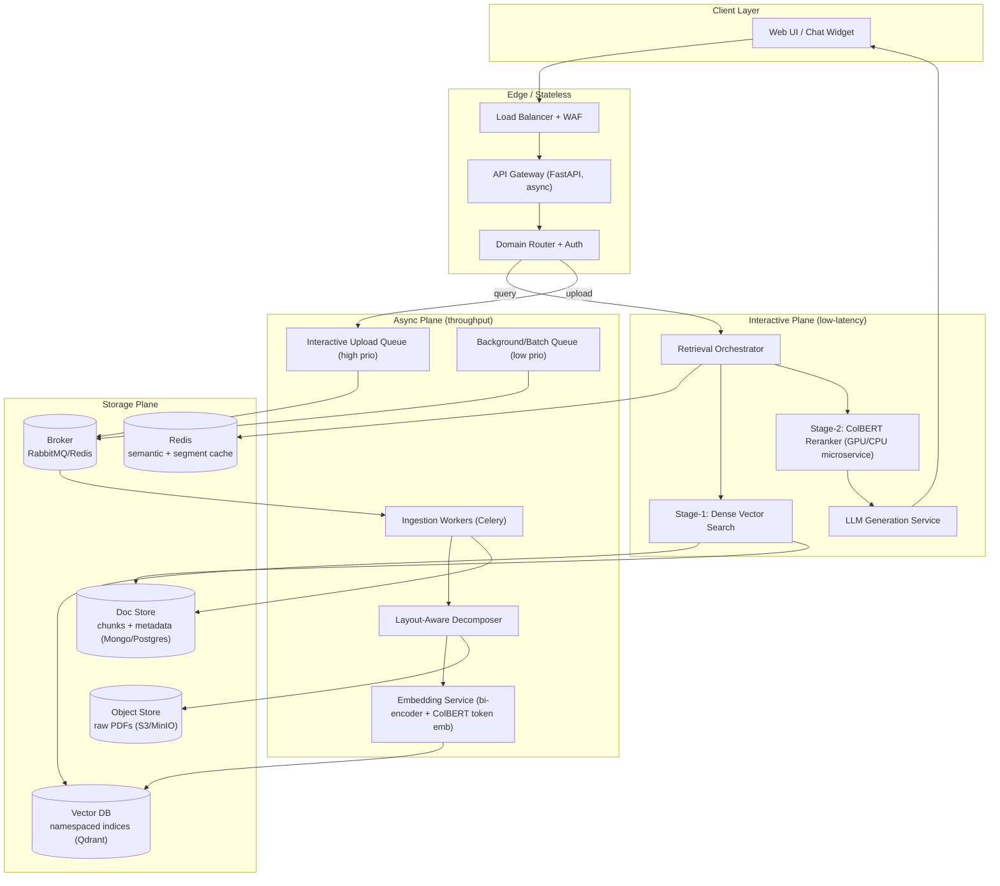
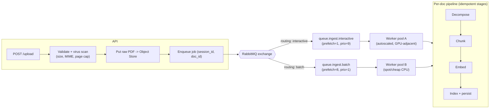
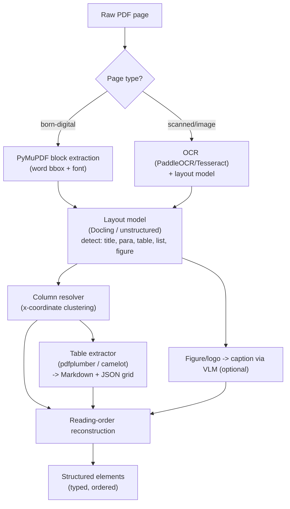
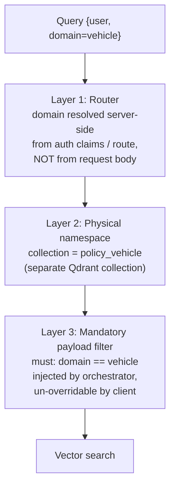
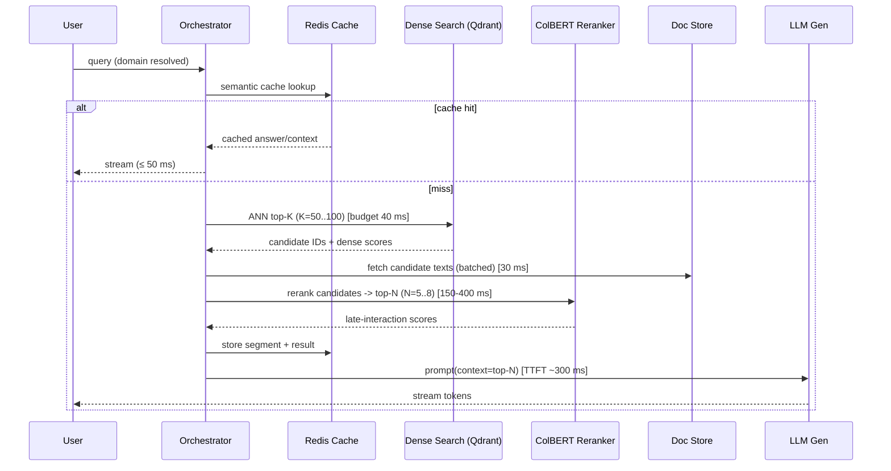
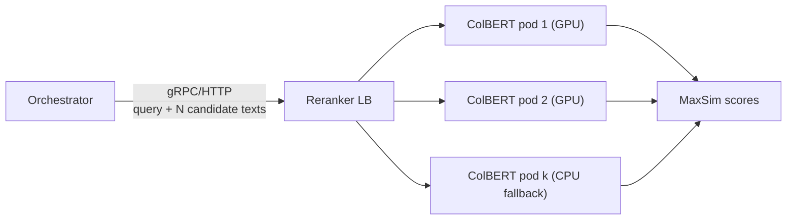
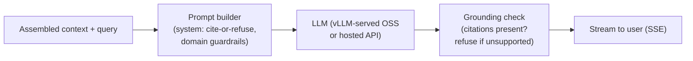
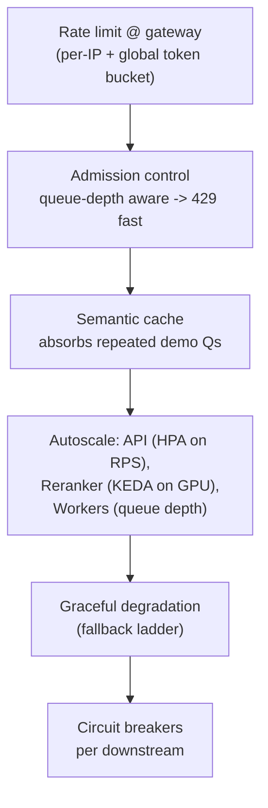
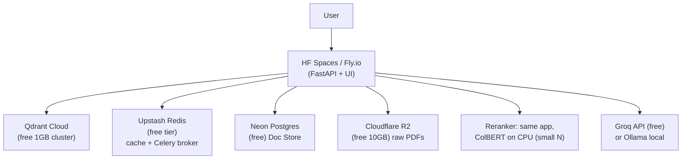

# Multi-Category Policy RAG Platform — System Design Specification

> **Status:** Design v1.0
> **Scope:** Production-grade, high-availability RAG for insurance policy Q&A across isolated domains (Vehicle / Term / General), with ad-hoc user PDF uploads and ColBERT late-interaction reranking.
> **Optimization targets:** p95 end-to-end latency, compute efficiency (GPU amortization), and hard data-consistency/isolation guarantees.
> **Python tooling:** [`uv`](https://github.com/astral-sh/uv) for dependency & environment management throughout.

---

## 0. Executive Summary

The platform is a **stateless-edge / stateful-core** RAG system. User traffic terminates at a thin async API gateway that does three things and nothing else: **authenticate, route by policy domain, and orchestrate a two-stage retrieval mesh**. All heavy work — PDF decomposition, embedding, ColBERT scoring — is pushed behind **decoupled queues** and **dedicated inference microservices** so that a spike in uploads can never degrade interactive query latency.

Data isolation between insurance domains is **structural, not advisory**: each domain owns a physically distinct vector namespace, and every retrieval call carries a mandatory, server-injected filter that the client cannot override. Ad-hoc user uploads live in **ephemeral, TTL-bound session namespaces** that are garbage-collected automatically and never pollute the curated corpora.

Two deployment profiles are specified:
- **Production profile** — managed cloud services, autoscaling GPU inference, HA everywhere.
- **Free/demo profile** — a $0 footprint (Fly.io / HF Spaces / Qdrant Cloud free tier / Groq or local GGUF) that preserves the same architecture so the demo is a faithful shrink of production.

---

## 1. High-Level Topology



**Design principle — two planes.** The *Interactive Plane* is latency-bound and horizontally scaled on CPU-cheap async workers plus a GPU reranker pool. The *Async Plane* is throughput-bound and isolated behind priority queues. They share only the Storage Plane, and the shared surfaces (Vector DB, Doc Store) are read-mostly on the hot path.

---

## 2. Technology Selection Matrix

| Concern | Production choice | Free/Demo choice | Rationale |
|---|---|---|---|
| Dependency mgmt | `uv` + `pyproject.toml` | `uv` | Deterministic, 10–100× faster resolves; single tool for venv + lock |
| API framework | FastAPI + Uvicorn/Gunicorn | FastAPI on Fly.io | Native async, Pydantic validation, streaming responses |
| Queue broker | RabbitMQ (quorum queues) | Redis (as broker) | Priority queues, per-message ACK, dead-lettering |
| Task engine | Celery | Celery | Mature, priority routing, retries, rate limits |
| PDF layout | `unstructured` + Docling / PaddleOCR | `PyMuPDF` + `pdfplumber` | Layout-aware, table & column detection |
| Bi-encoder | `bge-large-en-v1.5` / `e5-large` | `bge-small-en-v1.5` | Strong dense recall at low dim (384/1024) |
| Reranker | ColBERTv2 (RAGatouille / stanford-colbert) | ColBERTv2 (CPU, small batch) | Token-level late interaction, high precision |
| Vector DB | Qdrant (HNSW, payload filters) | Qdrant Cloud free 1GB | Native namespaces, hard metadata filters, quantization |
| Doc store | MongoDB / Postgres+JSONB | SQLite / Postgres (Neon free) | Chunk text + rich metadata |
| Object store | S3 | MinIO / Cloudflare R2 free | Raw PDF durability |
| Cache | Redis (cluster) | Redis (Upstash free) | Semantic cache + segment cache |
| LLM generation | vLLM-served OSS (Llama/Qwen) or hosted API | Groq API free tier / Ollama local | Streaming, function-safe grounding |
| Deploy | K8s (EKS/GKE) + KEDA autoscale | Fly.io + HF Spaces | Same container images across profiles |

---

## 3. Ad-Hoc Ingestion Pipeline

### 3.1 Decoupled Queue Topology

The single most important isolation guarantee: **an upload storm must never stall interactive queries.** We achieve this with *separate broker vhosts/queues* and *separate worker pools*, not just priorities on one queue.



**Worker isolation rules**
- **Pool A (interactive):** small `prefetch` (=1) so a slow doc doesn't head-of-line-block; short SLA; autoscaled on queue depth (KEDA/Celery autoscale). Users watch a progress bar, so latency matters.
- **Pool B (batch):** large prefetch, runs on cheap/spot instances, handles curated corpus (re)ingestion and re-embeds.
- **Backpressure:** `POST /upload` returns `202 Accepted` + a `job_id`; the client polls `GET /jobs/{id}` or subscribes via SSE/WebSocket. If `queue.ingest.interactive` depth > threshold, the gateway returns `429` with `Retry-After` rather than accepting work it cannot serve.
- **Idempotency:** `doc_id = sha256(bytes)`. Re-uploading identical content short-circuits to the existing index entry. Each stage is idempotent and checkpointed in the Doc Store (`stage_state`), so a crashed worker resumes rather than restarts.
- **Dead-letter:** poison messages route to `queue.ingest.dlq` after N retries with exponential backoff; surfaced to an ops dashboard.

### 3.2 Layout-Aware Content Decomposition

Insurance PDFs are hostile: multi-column exclusion matrices, nested tables, benefit schedules, stamped scans. Naïve `text = page.get_text()` destroys reading order and merges table cells into gibberish. The decomposer is a **cascade**:



Each emitted element is typed and carries geometry:

```json
{
  "element_id": "uuid",
  "type": "table | paragraph | title | list_item | figure_caption",
  "page": 12,
  "bbox": [x0, y0, x1, y1],
  "column_index": 1,
  "reading_order": 47,
  "text": "...",
  "table": { "format": "markdown", "grid": [[...]], "n_rows": 8, "n_cols": 4 },
  "confidence": 0.94
}
```

**Chunking strategy (layout-aware, not fixed-window):**
- Tables are **never split**; a whole exclusion matrix is one chunk, serialized as Markdown *plus* a flattened natural-language rendering (`"For {row_label}, {col_label} = {value}"`) so the bi-encoder can match on cell semantics.
- Prose is chunked on semantic boundaries (heading hierarchy) with a target of ~512 tokens and ~64-token overlap.
- Every chunk inherits its section path (`"Section 4 > Exclusions > 4.2"`) as a metadata breadcrumb for grounding and citation.

### 3.3 Multi-Column & Out-of-Order Mitigation (Edge Case)

Root cause: PDF text streams are painting-order, not reading-order. Two-column pages interleave left/right lines.

**Mitigation cascade (fail-forward):**
1. **Geometric column detection** — cluster word bounding boxes by `x0`. A bimodal/multimodal x-distribution ⇒ N columns. Sort within each column by `y`, then concatenate columns left-to-right, top-to-bottom.
2. **Layout-model arbitration** — Docling/`unstructured` `hi_res` provides reading-order predictions; when geometric and model order disagree beyond a threshold, prefer the layout model and flag `low_confidence_order=true`.
3. **Sanity gate** — compute a language-model perplexity / sentence-continuity score on the reconstructed text. If perplexity spikes (a symptom of scrambled order), fall back to per-column isolated chunking so at least each column stays internally coherent.
4. **Provenance** — every chunk keeps `bbox` + `page`, so even if order is imperfect, citations point the user to the exact region for verification.

---

## 4. Multi-Tenant Vector & Storage Topology

### 4.1 Storage Separation of Concerns

| Store | Holds | Access pattern | Why separate |
|---|---|---|---|
| **Object Store** (S3/MinIO) | Raw PDFs, original bytes | Write-once, rare read | Durability & re-processing source of truth; cheap |
| **Doc Store** (Mongo/Postgres) | Chunk text, element metadata, section paths, stage_state | Read on payload assembly, write on ingest | Vector DB should not be the source of truth for text; keeps vectors lean |
| **Vector DB** (Qdrant) | Bi-encoder vectors + ColBERT token vectors + filterable payload | High-QPS ANN read | Purpose-built HNSW; payload filters enforce isolation |
| **Cache** (Redis) | Semantic query cache, hot segment cache, job status | Very high QPS, TTL'd | Removes redundant DB/vector trips |

**Vectors store only what search needs.** The Vector DB payload holds *IDs and filter keys*, not the full chunk text. Full text is fetched from the Doc Store during payload assembly (§5.4). This keeps the HNSW graph small (better cache locality, faster search) and lets text be edited/redacted without re-indexing vectors.

### 4.2 Hard Domain Isolation

Isolation is enforced at **three layers** so a single bug cannot leak `Term Life` data into a `Vehicle` answer:



- **Layer 1 — Routing:** the domain is derived from the authenticated context / URL path (`/v1/vehicle/query`), never trusted from a client-supplied JSON field. A domain the user is not entitled to → `403`.
- **Layer 2 — Physical partition:** each curated domain is a **separate Qdrant collection** (`policy_vehicle`, `policy_term`, `policy_general`). Cross-collection queries are not expressible in a single call — isolation by construction.
- **Layer 3 — Filter defense-in-depth:** even within a collection, every search carries a server-injected `must` filter on `domain`. Redundant with Layer 2 by design; catches misconfiguration.

### 4.3 Vector Schema (Qdrant)

**Collection per domain**, e.g. `policy_vehicle`:

```jsonc
// Point payload schema
{
  "id": "uuid",                        // == chunk_id
  "vectors": {
    "dense": [/* 1024 floats, bge-large */],
    "colbert": [[/* 128-d */], ...]     // multi-vector, one per token (optional co-location)
  },
  "payload": {
    "domain": "vehicle",               // INDEXED, filterable  (Layer 3)
    "doc_id": "sha256...",             // INDEXED
    "provider": "acme_motor",          // INDEXED  (sub-tenant / insurer)
    "policy_type": "comprehensive",    // INDEXED
    "section_path": "4 > Exclusions",
    "page": 12,
    "chunk_ord": 47,
    "element_type": "table",
    "source": "curated",               // curated | user_upload   (INDEXED)
    "session_id": null,                // set only for uploads    (INDEXED)
    "expires_at": null,                // epoch; set for uploads  (INDEXED)
    "lang": "en"
  }
}
```

Qdrant config: HNSW (`m=16, ef_construct=128`), **scalar quantization (int8)** for the dense vectors to cut memory ~4× with negligible recall loss, `on_disk` payload for cold fields. Payload indexes on all `INDEXED` fields so filters are O(index) not O(scan).

### 4.4 Doc Store Schema (Postgres/JSONB or Mongo)

```sql
-- Postgres flavor
CREATE TABLE documents (
  doc_id        TEXT PRIMARY KEY,          -- sha256(bytes)
  domain        TEXT NOT NULL,
  source        TEXT NOT NULL,             -- curated | user_upload
  session_id    TEXT,                      -- FK-ish to ephemeral session
  provider      TEXT,
  title         TEXT,
  n_pages       INT,
  object_key    TEXT NOT NULL,             -- S3/MinIO key of raw PDF
  stage_state   JSONB NOT NULL DEFAULT '{}',   -- {decompose:done, embed:done...}
  expires_at    TIMESTAMPTZ,               -- NULL for curated
  created_at    TIMESTAMPTZ DEFAULT now()
);

CREATE TABLE chunks (
  chunk_id      TEXT PRIMARY KEY,
  doc_id        TEXT REFERENCES documents(doc_id) ON DELETE CASCADE,
  domain        TEXT NOT NULL,
  session_id    TEXT,
  page          INT,
  bbox          JSONB,
  section_path  TEXT,
  element_type  TEXT,
  chunk_ord     INT,
  text          TEXT NOT NULL,
  text_render   TEXT,                      -- NL rendering of tables
  meta          JSONB
);
CREATE INDEX ON chunks (doc_id);
CREATE INDEX ON chunks (session_id) WHERE session_id IS NOT NULL;
```

### 4.5 Ephemeral User Uploads — TTL & Dynamic Namespaces

User uploads must be queryable *instantly* within a session, must **never** contaminate curated recall, and must **self-destruct**.

**Namespace strategy:** uploads are *not* put in the curated domain collections. They go to a dedicated collection `ephemeral_uploads`, partitioned by `session_id` in the payload:

```jsonc
{
  "domain": "vehicle",          // the domain context the user is in
  "source": "user_upload",
  "session_id": "sess_ab12...", // partition key + filter
  "expires_at": 1731000000      // now + TTL (e.g. 2h)
}
```

**Query behavior — session-scoped union with hard fences:**
- A query in an active session searches curated `policy_<domain>` **and** `ephemeral_uploads WHERE session_id == current AND expires_at > now()`.
- The `session_id` filter is server-injected (same discipline as domain). One user can *never* see another user's upload.
- Results are merged (§5), with an optional recency boost for the just-uploaded doc.

**TTL / lifecycle management (three redundant reapers):**
1. **Filter-time exclusion:** every query filters `expires_at > now()`, so expired points are invisible *the instant they expire*, even before physical deletion.
2. **Scheduled GC:** a low-priority Celery beat task runs `delete(filter: expires_at < now())` on `ephemeral_uploads` every N minutes and cascades to Doc Store + Object Store (`ON DELETE CASCADE`).
3. **Session-end hook:** explicit logout / session teardown enqueues immediate purge of that `session_id`.

This gives clean namespaces with no index pollution: curated collections stay curated; ephemeral data is both logically fenced (filters) and physically reaped (GC).

---

## 5. Two-Stage Retrieval Mesh

### 5.1 Flow & Latency Budget

Target: **p95 ≤ 900 ms retrieval+rerank** (excluding LLM token streaming, which starts immediately after).



| Stage | Budget (p95) | Scaling axis |
|---|---|---|
| Cache lookup | 5–15 ms | Redis, O(1) |
| Stage-1 dense ANN | 30–50 ms | Qdrant replicas, HNSW `ef` |
| Doc Store batch fetch | 20–40 ms | Read replicas, `IN (...)` batch |
| Stage-2 ColBERT rerank | 150–400 ms | GPU batch size, N candidates |
| Payload assembly | 10–20 ms | Throttled (§5.4) |
| LLM TTFT | 250–500 ms | vLLM continuous batching |

### 5.2 Stage 1 — Dense Bi-Encoder Retrieval

- **Bi-encoder** (`bge-large`) embeds the query once; ANN search against the domain collection returns **top-K = 50–100** candidate IDs + cosine scores.
- Runs entirely in the Vector DB; no per-candidate model calls ⇒ cheap and fast. `ef` (HNSW search width) is tuned per profile: higher `ef` → better recall, more latency. Start `ef=128`.
- **Recall-first** here: Stage 1 optimizes recall (don't miss the right chunk), precision is Stage 2's job.
- Query embedding itself is cached (queries repeat in a demo).

### 5.3 Stage 2 — ColBERT Late-Interaction Reranker

Deployed as an **independent, autoscaled inference microservice** (its own container, its own pool), decoupled from the gateway so it can scale on GPU independently.



- **Late interaction:** ColBERT encodes query tokens and document tokens separately, then scores via **MaxSim** (sum over query tokens of max cosine to any doc token). This is far more precise than a single-vector bi-encoder because it matches at token granularity — critical for insurance nuance ("does *this* exclusion apply to *this* peril").
- **Compute posture:**
  - **GPU pods** for production: dynamic micro-batching across concurrent requests; batch reranking of N=50 candidates in one forward pass. GPU is the expensive resource, so it's pooled and amortized, never per-request-dedicated.
  - **CPU pods** as an overflow/free-tier fallback with reduced N (rerank only top-20) and int8-quantized ColBERT.
- **Autoscaling:** KEDA on request-queue depth + GPU utilization. Scale-to-min (not zero) in prod to avoid cold-start; scale-to-zero acceptable on the free tier with a warm-up ping.
- **Two co-location options for token embeddings:**
  1. Store ColBERT token vectors in Qdrant (multi-vector) and rerank inside the DB — fewer hops, but heavier index.
  2. Store only dense vectors; reranker re-encodes the *N* candidate texts on the fly. **Chosen default:** option 2 for N≤50 (re-encoding 50 short chunks is cheap and keeps the vector index lean). Switch to option 1 if N or QPS grows.

### 5.4 Score Normalization, Merging & Throttled Assembly

**Normalization** — dense cosine and ColBERT MaxSim are on different scales, so never add raw:
1. Min-max (or z-score) normalize each score list to [0,1] *within the candidate set*.
2. **Weighted fusion** or **RRF (Reciprocal Rank Fusion)** to combine. RRF is robust and scale-free:
   `score(d) = Σ_r 1 / (k + rank_r(d))`, `k=60`. Primary ranking uses ColBERT; dense rank is a tiebreaker/floor.
3. Apply metadata boosts (recency for fresh uploads; `section_path` relevance) *after* fusion.

**Payload assembly throttling** (prevents resource exhaustion under spikes):
- Assembly (fetch full text for the final top-N, build the prompt) is bounded by a **semaphore / bounded thread pool** — only M concurrent assemblies system-wide. Excess requests wait briefly or shed with `503` + `Retry-After`.
- Doc Store fetches are **batched** (`WHERE chunk_id IN (...)`), never N+1.
- **Token-budget guard:** the assembled context is capped (e.g. ≤ 6k tokens); if top-N overflows, drop lowest-fused chunks. Prevents a pathological query from ballooning LLM cost/latency.
- Assembled contexts are cached by `hash(top-N chunk_ids)` so identical retrieval sets reuse the built prompt.

---

## 6. LLM Generation Layer



- **Grounding contract:** system prompt mandates answers cite `doc_id + page + section_path`; if the retrieved context doesn't support an answer, the model must say so ("Not covered in the provided policy documents") rather than hallucinate — essential for insurance correctness.
- **Serving:** vLLM (continuous batching, PagedAttention) for OSS models in prod; **Groq API** (free tier) or **Ollama** (local GGUF) for the demo. Same OpenAI-compatible interface so the app code is deployment-agnostic.
- **Streaming:** tokens stream via SSE the moment TTFT is reached; the user sees output while later tokens generate, hiding tail latency.
- **Model default:** for building this app, prefer the latest capable models; the generation layer is pluggable behind an interface so the hosted-vs-local choice is a config flag.

---

## 7. Production Resilience & Edge Cases

### 7.1 Concurrency Spikes During a Live Demo

A public demo is bursty: everyone clicks at once. Defenses, outermost-first:



- **Rate limiting & admission control:** per-IP and global token buckets at the edge; fail fast with `429` rather than accepting work that will time out. Interactive queries are prioritized over uploads when capacity is scarce.
- **Semantic cache is the spike absorber:** in a demo, the same handful of questions dominate. A semantic cache (embed the query, match cached queries by cosine ≥ 0.95) can serve a large fraction of traffic in ~10 ms with zero retrieval cost. This is the single highest-leverage defense for a demo.
- **Autoscaling:** API layer on HPA (RPS/CPU); ColBERT pool on KEDA (GPU util + queue depth) with a warm minimum; ingestion workers on queue depth. Uploads and queries scale independently.
- **Graceful degradation ladder** (shed quality before shedding availability):
  1. Normal: dense + ColBERT(N=50) + full LLM.
  2. Load high: reduce ColBERT N to 20; lower HNSW `ef`.
  3. Load severe: skip ColBERT, serve dense top-5 directly.
  4. Reranker down: circuit-breaker opens → dense-only path (degraded precision, still answers).
  5. LLM down: return extractive top chunks with citations ("here are the relevant clauses").
- **Circuit breakers & timeouts** on every downstream (Qdrant, reranker, LLM, Doc Store) with sane deadlines so one slow dependency can't cascade. Bulkheads (separate connection pools) prevent cross-contamination.

### 7.2 Cache Management (avoid redundant DB/vector trips)

Multi-tier caching, each keyed to invalidate correctly:

| Tier | Key | Value | TTL / Invalidation |
|---|---|---|---|
| **Query embedding cache** | `hash(query_text, model)` | dense vector | long TTL; model version in key |
| **Semantic answer cache** | approx-match on query embedding (cosine ≥ 0.95) within `domain` | final answer + citations | short TTL (mins) in demo; bust on corpus update |
| **Retrieval-set cache** | `hash(query_norm, domain, filters)` | top-N chunk_ids + scores | mins; bust on domain re-index |
| **Hot segment cache** | `chunk_id` | full chunk text + meta | long; write-through on chunk edit |
| **Assembled-prompt cache** | `hash(sorted chunk_ids)` | built prompt string | mins |

- **Namespacing:** all cache keys are prefixed with `domain` and a **corpus version stamp** (`policy_vehicle:v7:...`). Re-indexing a domain bumps its version, atomically invalidating every stale entry for that domain without touching others.
- **Ephemeral uploads are never in the shared answer cache** (they're session-private); they may use a session-scoped cache keyed by `session_id`.
- **Frequently-hit segments** (popular clauses) stay hot in Redis, eliminating repeated Doc Store fetches during payload assembly — directly attacking the "redundant DB trip" requirement.

### 7.3 Data Consistency

- **Source of truth = Doc Store + Object Store.** The Vector DB is a derived index; it can always be rebuilt from source by replaying embed+index. This makes vector corruption recoverable.
- **Ingestion is transactional per stage** with `stage_state` checkpoints; a chunk is only searchable after both its vector is indexed *and* its row is committed (index-after-commit ordering; the query path tolerates a vector whose text is momentarily absent by skipping it).
- **Deletes cascade** Object → Doc → Vector; the query-time `expires_at` filter guarantees correctness even during the window between logical expiry and physical GC.

---

## 8. Repository & `uv` Project Layout

```
policy_rag_chatbot/
├── pyproject.toml            # uv-managed; dependency groups per service
├── uv.lock                   # committed lockfile (reproducible builds)
├── .python-version
├── services/
│   ├── gateway/              # FastAPI: auth, routing, orchestrator
│   ├── ingest/               # Celery workers, layout decomposer
│   ├── embed/                # bi-encoder + colbert token embedding
│   ├── reranker/             # ColBERT inference microservice
│   └── common/               # schemas, qdrant client, cache, config
├── infra/
│   ├── docker/               # per-service Dockerfiles (uv-based)
│   ├── compose.yaml          # local full-stack (demo)
│   └── k8s/                  # prod manifests + KEDA/HPA
└── ARCHITECTURE.md
```

**Dependency groups in `pyproject.toml`** keep each service image lean:

```toml
[project]
name = "policy-rag-chatbot"
requires-python = ">=3.11"
dependencies = ["pydantic>=2", "httpx", "qdrant-client", "redis"]

[dependency-groups]
gateway  = ["fastapi", "uvicorn[standard]", "sse-starlette"]
ingest   = ["celery[redis]", "unstructured[pdf]", "pymupdf", "pdfplumber"]
embed    = ["sentence-transformers", "FlagEmbedding"]
reranker = ["ragatouille", "torch"]

[tool.uv]
# reproducible, isolated resolves per group
```

**Common `uv` commands**

```bash
uv sync --group gateway            # install only what the gateway needs
uv run --group ingest celery -A services.ingest worker -Q ingest.interactive
uv run --group reranker python -m services.reranker.serve
uv lock                            # regenerate the committed lockfile
```

Dockerfiles use `uv sync --frozen --no-dev --group <svc>` for fast, deterministic, cache-friendly builds.

---

## 9. Free / $0 Deployable Profile

A faithful shrink of production — same containers, same code paths, free tiers:



| Component | Free service | Limits/adaptation |
|---|---|---|
| App + UI | **Fly.io** (shared-cpu-1x) or **HF Spaces** | 1–2 small instances; scale-to-zero when idle |
| Vector DB | **Qdrant Cloud free (1 GB)** | int8 quantization; smaller embedding dim (`bge-small`, 384-d) |
| Broker + Cache | **Upstash Redis (free)** | Redis as Celery broker + cache; small in-process worker |
| Doc Store | **Neon Postgres (free)** or SQLite | JSONB metadata |
| Object Store | **Cloudflare R2 (free 10 GB)** or MinIO container | raw PDFs |
| Reranker | ColBERT **on CPU**, rerank top-20 only | quantized; acceptable at demo QPS |
| LLM | **Groq free API** (fast) or **Ollama** (local GGUF) | OpenAI-compatible; same interface |
| Compute | run ingest worker **in-process/threaded** | single-node Celery via Redis |

Degradations vs prod are quantitative (smaller K/N, CPU reranker, single replica), **not architectural** — the isolation model, queue decoupling, TTL namespaces, and two-stage mesh are all preserved, so the demo proves the real design.

---

## 10. Summary of Guarantees

| Requirement | How it's guaranteed |
|---|---|
| Uploads never stall queries | Separate queues + separate worker pools + admission control |
| Layout-aware extraction | Cascade: layout model → column resolver → table extractor → reading-order reconstruction |
| Multi-column correctness | Geometric + model arbitration + perplexity sanity gate + bbox provenance |
| Hard domain isolation | Server-side routing + physical per-domain collections + mandatory injected filter (3 layers) |
| Ephemeral upload hygiene | Dedicated `ephemeral_uploads` collection, session filter, TTL via query-filter + GC + session hook |
| Low-latency retrieval | Dense ANN (≤50 ms) → ColBERT rerank (GPU-batched) → throttled assembly; p95 ≤ 900 ms |
| Spike survival | Rate limit → cache → autoscale → degradation ladder → circuit breakers |
| No redundant DB trips | Multi-tier, version-stamped cache; hot-segment cache |
| Data consistency | Doc/Object store as source of truth; rebuildable vector index; cascading deletes |
| Reproducible builds | `uv` + committed `uv.lock`, per-service dependency groups |
| $0 demo | Free-tier mirror of the same architecture |
```
